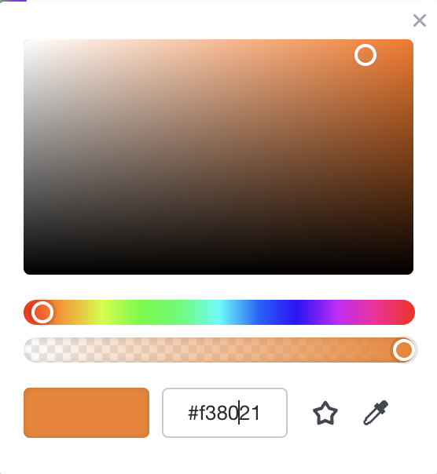
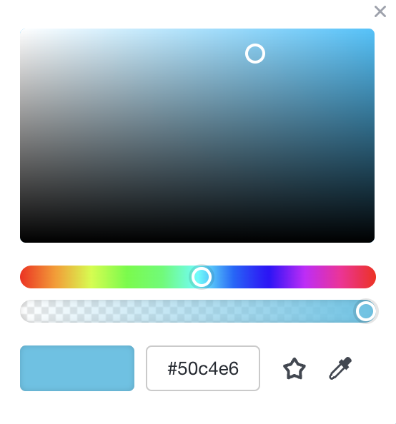
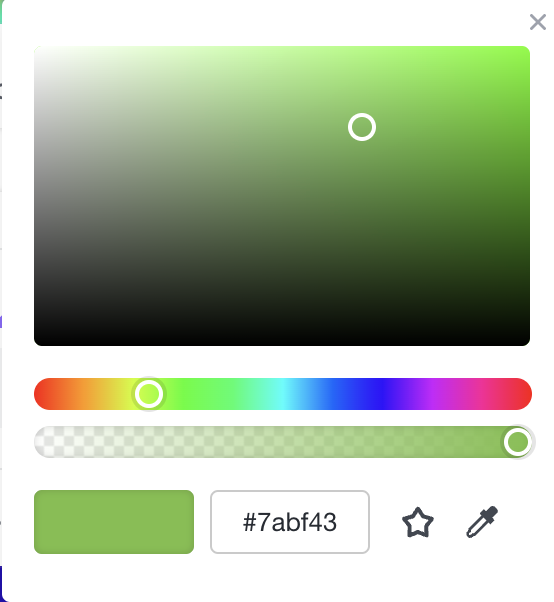

# drf_nexus-cares
# NexusCARES
by {{ Mienke Dreyer }}
She Codes crowdfunding project - DRF Backend.

## About
{{ Creating an app to simplify and promote volunteers and funding for Nexus Care's projects. Nexus Care is an existing organization based in Brisbane that provides various community services, including food relief programs, career coaching clinics, emergency financial relief, and workplace English classes.This app could play a crucial role in supporting Nexus Care's efforts and expanding their impact, allowing for more community involvement in funding but also volunteers.}}

## Features
{{ The features your MVP will include. (Remember this is a working document, you can change these as you go!) }}
* [Project Listings] Create a section where Nexus Care can list their ongoing and upcoming projects, such as food relief programs, career coaching clinics, emergency financial relief, and workplace English classes. Each project should have a detailed description, the expected impact, and the amount of funding or volunteers needed.

### Stretch Goals
{{ Outline three features that will be your stretch goals if you finish your MVP }}
* [Volunteer Sign-Up] Offer a user-friendly interface that allows individuals to sign up as volunteers for specific projects. Volunteers can indicate their availability, skills, and interests, which will help Nexus Care match them with suitable projects.ture
* [Donation Platform] Implement a secure payment gateway to facilitate financial contributions from users. People interested in supporting Nexus Care's projects can donate money to specific initiatives or the organization as a whole.
* [Skills Matching] Develop a feature that allows users to list their skills and expertise, and then match them with projects that require those particular skills. For example, if someone is good at marketing, they can be directed to projects that could benefit from their marketing knowledge.
* [Progress Tracking] Provide regular updates on the progress and impact of completed projects, showcasing the difference volunteers and donors have made in the community.
* [Expansion to Flash Projects] Enable a feature where Nexus Care or other organizations can post flash projects or urgent needs that require immediate attention. This can include emergency relief for individuals or families facing unforeseen circumstances.
* [Social Sharing] Encourage users to share their involvement and contributions on social media platforms, promoting the app and attracting more volunteers and donors.

## API Specification

## Database Schema
{{ Insert your database schema }}

[initial schema](<crowdfunding/img/database schema initial.png>) 

## Wireframes
{{ Insert your wireframes }}

## Colour Scheme
{{ Existing colour scheme used by Nexus Care }}

## Fonts
{{ Uses Hallo Euroboy and Helvetica }}

## Submission Documentation
{{ Fill this section out for submission }}

Deployed Project: [Deployed website](http://127.0.0.1:8000/projects/)

### Updated Wireframes
{{  Updated wireframes }}

### How To Register a New User
{{ Step 1: Open Insomnia
    Launch the Insomnia app on your computer.

Step 2: Create a New Request
    Click the "+" button in the top-left corner to create a new request.
    Give your request a suitable name, like "Create New Project."

Step 3: Set the HTTP Method to POST
    In the request panel, locate the dropdown menu that shows the HTTP method (usually GET by default).
    Select "POST" from the dropdown menu.

Step 4: Enter the Endpoint URL
    In the URL field, enter the endpoint URL for creating a new project. It might look something like: https://api.example.com/projects

Step 5: Add Request Headers 
    click on the "Headers" tab within the request panel.
    Add any necessary headers like authentication tokens or content type.

Step 6: Define Request Body Data
    Click on the "Body" tab within the request panel.
    Select the type of data you're sending. Select "JSON" from the dropdown.
    Enter the project information in the JSON format. 

Step 7: Send the Request
    Click the "Send" button located at the bottom of the request panel.

Step 8: Review Response 
    After sending the request, Insomnia will display the API response.
    Check the response to see if the project was successfully created or if there were any errors.
 }}

### Screenshots
* [x] A screenshot of Insomnia, demonstrating a successful GET method for any endpoint.

* [x] A screenshot of Insomnia, demonstrating a successful POST method for any endpoint.

* [x] A screenshot of Insomnia, demonstrating a token being returned.
